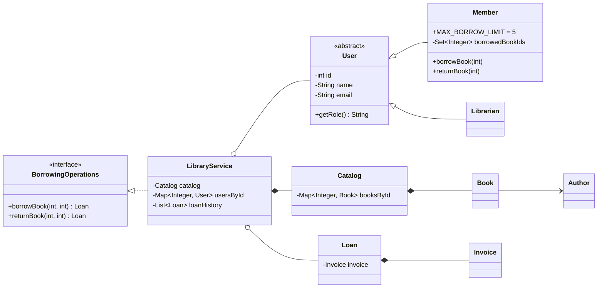

# Library Management System - Design

## Class Diagram

## Design Notes

- **Encapsulation:** domain fields are private and state changes are controlled by methods.
- **Inheritance:** `Member` and `Librarian` extend abstract `User`.
- **Polymorphism:** different user types are stored as `Map<Integer, User>`.
- **Abstraction:** `User` is abstract and `BorrowingOperations` is an interface.
- **Composition:** `LibraryService` has a `Catalog`; `Loan` owns an `Invoice`.
- **Collections:** `Map` stores books/users, `Set` prevents duplicate active borrowed books, and `List<Loan>` stores loan history.

## Reference Diagram Adaptation

The challenge allows a custom OOP design. The reference UML shows book types such as Journals, StudyBooks and Magazines as subclasses. Because no different behavior is defined for those types, this implementation represents book types with `Category`. Inheritance is used where behavior differs: `User -> Member` and `User -> Librarian`.
